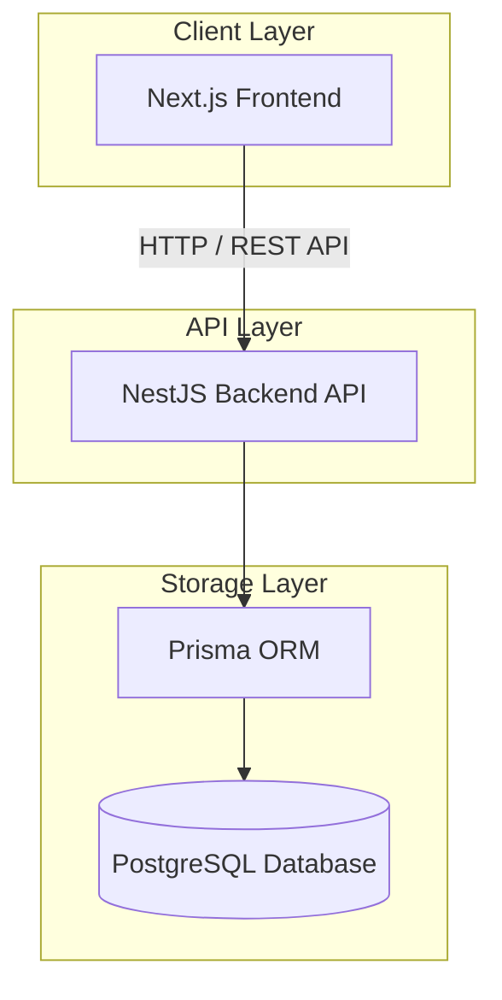

# Dezai AI — Full Architecture Specification

> **This document is the canonical source of truth for the Dezai AI platform's codebase architecture and directory layout.**
> All future code modifications, additions, and refactorings must conform to the rules, structures, and boundaries specified in this contract.

---

## 1. Architectural Overview

Dezai AI is structured as a university-grade EdTech SaaS platform designed with a decoupled frontend and backend architecture. 



### High-Level Tech Stack
* **Frontend**: Next.js 15 (App Router, React 19, TypeScript), styled with Tailwind CSS & Shadcn UI, state managed with Zustand, server state synchronized via React Query.
* **Backend**: NestJS-style Node.js API (TypeScript), structured with modular design, Dependency Injection, and Zod validator schemas.
* **Database**: PostgreSQL mapped via Prisma ORM.
* **External Integrations**: Razorpay (INR payments), PDF generation (certificates), live video streaming wrappers, client-side webcam proctoring triggers.

---

## 2. Global Repository Layout

The repository is organized to separate frontend application code, backend application code, documentation, database design artifacts, and deployment/setup scripts.

```
DEZAI/
├── frontend/             # Next.js Web Application
├── backend/              # NestJS-style API Server
├── database/             # Diagrams, schemas, raw migrations, and seeders
├── docs/                 # Product, design, and architecture documentation
└── scripts/              # Setup, deployment, and maintenance scripts
```

---

## 3. Frontend Architecture

The frontend follows a **Feature-Based & Sliced Architecture**. Business logic is strictly encapsulated within self-contained features, keeping the routing layer and shared folder highly reusable and domain-agnostic.

### 3.1 Directory Layout
```
frontend/src/
├── app/                          # Next.js Routing Layer (THIN)
│   ├── (admin)/                  # Admin-only pages
│   ├── (auth)/                   # Authentication pages (login, signup)
│   ├── (marketing)/              # Public landing / marketing pages
│   ├── (student)/                # Student dashboard & player pages
│   ├── (university)/             # University admin portal
│   ├── guards/                   # Route protection / RBAC middleware
│   ├── layouts/                  # Shared page layout shells
│   ├── providers/                # React Context Providers
│   ├── globals.css               # Global CSS & Tailwind configuration
│   ├── layout.tsx                # Root layout
│   └── page.tsx                  # Root homepage (redirects)
│
├── features/                     # BUSINESS LOGIC ENCAPSULATION
│   ├── auth/                     # Authentication components, hooks, schemas
│   ├── users/                    # Profile management & timeline
│   ├── dashboard/                # Main student dashboard
│   ├── academy/                  # Universities, partners, and institutional info
│   ├── programs/                 # Course catalog, syllabus, details, enrollment
│   ├── learning/                 # Course player, modules, notes, progress tracking
│   ├── assessments/              # Quiz engine, timers, attempts, security toasts
│   ├── credentials/              # Certificate preview, verification, metadata
│   ├── projects/                 # Sandbox, capstones, and project features
│   ├── ai-mentor/                # AI study assistant chat interface
│   ├── institution/              # University administrator interfaces
│   └── settings/                 # Profile, notification, billing, security settings
│
├── shared/                       # DOMAIN-AGNOSTIC REUSABLE UTILITIES
│   ├── components/               # Generic composed widgets
│   │   ├── button/               # Extracted Shadcn Button wrappers
│   │   ├── input/                # Form Input components
│   │   ├── textarea/             # Multi-line inputs
│   │   ├── select/               # Dropdowns
│   │   ├── modal/                # Dialog triggers
│   │   ├── drawer/               # Sheets & sliding panels
│   │   ├── table/                # Grid & list views
│   │   ├── pagination/           # Page navigators
│   │   ├── empty-state/          # Empty data displays
│   │   ├── page-header/          # Dynamic page titles
│   │   ├── breadcrumbs/          # Location indicators
│   │   ├── search-bar/           # Query filters
│   │   ├── filters/              # Categorized filters
│   │   ├── loader/               # Skeletons and spinners
│   │   ├── toast/                # Notifications
│   │   └── dialog/               # Confirmations
│   ├── constants/                # Global constants (e.g., pagination defaults)
│   ├── hooks/                    # Reusable hooks (useLocalStorage, useDebounce)
│   ├── services/                 # Global client-side api fetchers
│   ├── types/                    # Common interface/type definitions
│   └── utils/                    # Utility functions (cn, formatters)
│
├── core/                         # ENGINE CONFIGURATION
│   ├── api/                      # Axios/Fetch client config, interceptors
│   ├── auth/                     # Core session definitions
│   ├── permissions/              # RBAC rules matrix
│   ├── storage/                  # Local / Session storage wrappers
│   ├── config/                   # Global env variables & flags
│   └── theme/                    # Color scales & tokens
│
├── assets/                       # Images, SVG icons, fonts
├── styles/                       # CSS stylesheets & theme injects
└── tests/                        # E2E & integration test suites
```

### 3.2 App Router Rules
The `app/` directory serves exclusively as a **thin routing layer**. It must contain only:
* `page.tsx`: Imports and mounts a component from a feature page.
* `layout.tsx`: Structural wrappers (providers, navbars, sidebars).
* `loading.tsx`: Suspense fallbacks.
* `error.tsx`: Catch-all boundary states.

**Forbidden in `app/`**:
* Inline React components with business logic.
* Direct API fetch statements.
* Zustand state definitions.
* Direct database queries or API hooks.

### 3.3 Feature Internal Structure
Every feature directory MUST structure its internal modules as follows to preserve structural consistency:
```
features/<feature-name>/
├── components/                   # Sub-components internal to this feature
├── hooks/                        # Custom React hooks containing feature state
├── pages/                        # Page-level containers (mounted in app/)
├── services/                     # Feature API request files
├── store/                        # Feature Zustand store files
├── types/                        # Feature-specific TypeScript typings
├── validations/                  # Zod validation schemas
├── utils/                        # Feature-specific formatters or calculations
└── index.ts                      # public barrel file (exposes API)
```

### 3.4 Shared Directory Guidelines
Files in `shared/` must be entirely **domain-agnostic** and work out-of-the-box in any project with zero domain knowledge.
* **Yes**: `button/`, `modal/`, `useDebounce`, `formatDate`.
* **No**: `CourseCard`, `QuizTimer`, `useEnrollment`, `CertificatePreview` (these must live in their respective feature folders).

---

## 4. Backend Architecture

The backend utilizes a **NestJS-style Modular Architecture** to enforce clean separation of concerns, separation of HTTP handlers (Controllers), business logic (Services), and database interactions (Repositories).

### 4.1 Directory Layout
```
backend/src/
├── modules/                      # FEATURE ENCAPSULATED MODULES
│   ├── auth/                     # Module for authentication & JWT logic
│   ├── users/                    # Module for student/user data
│   ├── institutions/             # Module for university partners
│   ├── academy/                  # Module for degree/academic metadata
│   ├── programs/                 # Module for course creation & syllabus
│   ├── learning/                 # Module for progress tracker & lesson routes
│   ├── assessments/              # Module for quiz proctoring and grading
│   ├── credentials/              # Module for certificate PDF generation
│   ├── projects/                 # Module for sandbox submissions
│   ├── ai/                       # Module for mentor agent integrations
│   └── analytics/                # Module for financial ledger calculations
│
├── common/                       # CROSS-CUTTING INFRASTRUCTURE
│   ├── decorators/               # Custom NestJS-style decorators (e.g., @CurrentUser)
│   ├── guards/                   # RBAC & token check guards
│   ├── interceptors/             # Response parsing, timeout, and logging interceptors
│   ├── filters/                  # Global exceptions and format filters
│   ├── middleware/               # Logger & request correlation middleware
│   ├── constants/                # Project constants
│   └── utils/                    # Global utilities
│
├── config/                       # Application config & environment schemas
├── database/                     # DB client connection & context pool management
├── jobs/                         # Queue handlers & cron schedule registers
└── main.ts                       # Application entry point
```

### 4.2 Module Internal Structure
Every feature module follows a strict subfolder partition:
```
modules/<module-name>/
├── controllers/                  # Express route controllers & parameters
├── services/                     # Business logic layers
├── repositories/                 # Database Prisma adapter methods
├── dto/                          # Data Transfer Objects (request/response schemas)
├── entities/                     # Domain representations (mapped from db)
├── validators/                   # Zod schemas for input validation
└── <module-name>.module.ts       # Module entry file mapping dependencies
```

---

## 5. Database & Schema Architecture

The database model definitions live in the database folder and are synchronized with the backend application code via Prisma.

### 5.1 Structure
```
database/
├── diagrams/                     # Entity-relationship diagrams (ERD)
├── schemas/                      # Domain-specific SQL schemas
├── migrations/                   # Direct DB migrations
└── seeders/                      # Seed scripts

backend/prisma/
├── schema.prisma                 # Primary database model file
├── migrations/                   # Auto-generated Prisma migration SQL files
└── seeders/                      # Prisma seed scripts
```

### 5.2 Prisma Model Requirements
All model additions must maintain:
* Consistent pluralization mapping (`@@map("users")`).
* Standard primary keys (`id String @id @default(uuid())`).
* Explicit relation descriptors to avoid loose fields.
* Auto-updating timestamps (`createdAt DateTime @default(now())`, `updatedAt DateTime @updatedAt`).

---

## 6. Security, Authentication, & RBAC

The platform utilizes Role-Based Access Control (RBAC) to restrict page views on the frontend and API access on the backend.

### 6.1 User Roles
* `STUDENT`: Base role. Access to dashboards, learning player, and quiz attempts.
* `UNIVERSITY_ADMIN`: Institutional views. Read-write access to academy data, student rosters, and analytics for their university.
* `DEZAI_ADMIN`: Global access. Full administrative permissions over partner registry, ledgers, database, and system configurations.

### 6.2 Boundary Validation Matrices

```
Client Request ──► [Route Guard (RBAC)] ──► [Zod Schema Validator] ──► [Module Controller]
```

1. **Route Guards**: Verifies token legitimacy (JWT) and checks user claims against the required module permission level.
2. **DTO Validators**: All payload inputs are verified at runtime using Zod schemas inside the controller pipeline.

---

## 7. Import Boundary Policy

To prevent spaghetti interdependencies and circular imports, imports are restricted to flow along a single path:

```
[ app/ ]
   │
   ▼
[ features/ ] ──────► (via barrel index.ts only) ──────► [ features/ ]
   │
   ▼
[ shared/ ] ◄──────── [ core/ ] ◄──────── [ lib/ ]
```

### Enforcement Rules
1. **No Deep Feature Imports**: Under no circumstances may a feature reach inside another feature's folders (e.g., `import X from '../courses/components/course-card'` is forbidden). Use the barrel import instead (`import { CourseCard } from '../courses'`).
2. **Shared Constraint**: No file in the `shared/` directory may import from any file in `features/` or `app/`.
3. **Core Isolation**: `core/` files configure engines and constants, and must not import from UI components.

---

## 8. Directory Reference Matrix

| Directory | Layer | Purpose | Status |
|---|---|---|---|
| `frontend/src/app` | Routing | Handles route definitions, layout wrappers, and guards | Active |
| `frontend/src/features` | Business Logic | Feature-sliced business components and hooks | Active |
| `frontend/src/shared` | Reusable UI | Composed UI primitives and generic hooks | Active |
| `backend/src/modules` | API Features | Controllers, services, and modules mapping domains | Active |
| `backend/src/common` | Middleware | Access controls, logging, and error wrappers | Active |
| `database` | Database | Raw SQL schemas, database architecture drafts | Active |
| `docs` | Documentation | Contains PRD, FRS, UI specification, and architecture files | Active |
| `scripts` | Maintenance | Deployment, setup scripts, database migration runners | Active |
